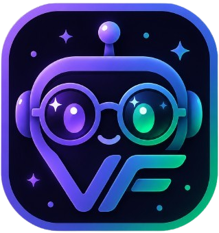

<div align="center">

<!-- Replace with your logo -->


<!-- Replace with hackathon badge/banner -->


# VisionForge

**AI agent that builds fully-labeled computer vision datasets from a plain-English request.**

[](LICENSE)
[](https://www.python.org)
[](https://google.github.io/adk-docs/)
[](https://www.mongodb.com/atlas)

*Built for the **Google Cloud Rapid Agent Hackathon — MongoDB Track***

</div>

---

## What it does

Type a plain-English request like *"build a dataset of gaming mice"* and VisionForge runs a fully automated pipeline — from raw image collection through to export-ready labeled datasets — in a single agent run.

### Pipeline

| Step | What happens |
|------|-------------|
| **Image Collection** | Searches Unsplash, filters by resolution, uploads to Google Cloud Storage |
| **Gemini Annotation** | Gemini Vision identifies every object with pixel-accurate bounding boxes and class labels — processed in parallel across all images |
| **Validation** | A second Gemini pass crops each bounding box region and confirms the label, rejecting false positives |
| **Deduplication** | Perceptual hashing (pHash) removes near-duplicate images before export |
| **Export** | YOLO and COCO zip archives generated and uploaded to GCS, ready to drop into any training pipeline |
| **Embedding** | Dataset query is embedded with `text-embedding-004` and stored in MongoDB Atlas for semantic search |

### Web UI features

- **Live pipeline progress** — real-time step-by-step status streamed over SSE as the agent works, with a live spinner and completion summary for each stage
- **Chat log** — the agent narrates what it's doing at each step in a conversational interface
- **One-click downloads** — YOLO and COCO format zip archives available for download the moment the pipeline finishes
- **Datasets browser** — every completed dataset is stored and versioned in MongoDB Atlas and browsable in the UI
- **Semantic AI search** — search your dataset library using natural language (e.g. type *"instruments"* to find a *"electric guitars"* dataset). Powered by MongoDB Atlas Vector Search with `text-embedding-004` embeddings — not a keyword filter
- **Annotated image gallery** — click any dataset to browse every image it contains, with Gemini's bounding boxes and class labels drawn as SVG overlays scaled precisely to each thumbnail
- **Dataset naming** — each pipeline run gets a unique human-readable name (e.g. *"Gaming Mice — Jun 2026"*) alongside the subject query, so multiple runs of the same topic are clearly distinguishable
- **Dataset splits** — train / val / test split breakdown shown visually for every dataset

---

## Requirements

- **Python 3.11+**
- **Node.js 18+** — ADK spawns the MongoDB MCP server via `npx`
- **Google Cloud project** with Vertex AI API enabled
- **MongoDB Atlas cluster** (free M0 tier works)
- **Unsplash developer account** — free API key at [developers.unsplash.com](https://developers.unsplash.com)
- **Two GCS buckets**: `visionforge-raw` and `visionforge-exports`

---

## Setup

### 1. Clone and install

```bash
git clone https://github.com/shaunthomas04/visionforge.git
cd visionforge
pip install -r requirements.txt
```

### 2. Install frontend dependencies

```bash
cd frontend && npm install && cd ..
```

### 3. Configure environment variables

```bash
cp .env.example .env
```

Open `.env` and fill in every value:

| Variable | Where to get it |
|----------|----------------|
| `GOOGLE_CLOUD_PROJECT` | GCP Console → Project ID |
| `GOOGLE_CLOUD_LOCATION` | Set to `global` |
| `GEMINI_MODEL` | Set to `gemini-3.1-flash-lite` |
| `UNSPLASH_ACCESS_KEY` | [developers.unsplash.com](https://developers.unsplash.com) → New Application |
| `MONGODB_URI` | Atlas → Connect → Drivers → copy connection string |
| `GCS_BUCKET_RAW` | Set to `visionforge-raw` (or your bucket name) |
| `GCS_BUCKET_EXPORTS` | Set to `visionforge-exports` (or your bucket name) |

### 4. Authenticate with Google Cloud

```bash
gcloud auth application-default login
gcloud config set project YOUR_PROJECT_ID
```

### 5. Create the MongoDB Atlas Vector Search index

In the MongoDB Atlas UI:

1. Go to your cluster → **Atlas Search** → **Create Search Index**
2. Select **Atlas Vector Search** → **Bring your own embeddings**
3. Database: `visionforge` · Collection: `datasets`
4. Index name: `datasets_vector`
5. Switch to the **JSON Editor** and paste:

```json
{
  "fields": [
    {
      "type": "vector",
      "path": "embedding",
      "numDimensions": 768,
      "similarity": "cosine"
    }
  ]
}
```

6. Click **Create Search Index** and wait for status to show **Active**

---

## Running locally

Open **two terminals**:

**Terminal 1 — ADK backend (port 8000):**

```bash
adk api_server . --allow_origins http://localhost:5173
```

**Terminal 2 — React frontend (port 5173):**

```bash
cd frontend
npm run dev
```

Open [http://localhost:5173](http://localhost:5173) in your browser.

---

## Deploying to Cloud Run

```bash
adk deploy cloud_run agent \
  --project $GOOGLE_CLOUD_PROJECT \
  --region $GOOGLE_CLOUD_REGION \
  --service-name visionforge
```

> For Cloud Run deployments, set `MONGODB_MCP_SERVER_URL` to the SSE URL of a deployed MongoDB Atlas MCP sidecar. The agent will connect over SSE instead of spawning the MCP server locally via `npx`.

---

## Architecture

```
Browser (React SPA)
    │
    │  SSE stream  /run_sse
    ▼
ADK FastAPI  ──  google-adk (Google Cloud Agent Builder)
    │
    ▼
Gemini Vision  (Vertex AI · gemini-3.1-flash-lite)
    │
    ├── search_images        →  Unsplash API  →  GCS visionforge-raw/
    ├── annotate_images      →  Gemini Vision, 10 parallel workers
    ├── validate_annotations →  Gemini Vision crop check, 10 parallel workers
    ├── deduplicate          →  pHash (imagehash)
    ├── export_dataset       →  YOLO + COCO zips  →  GCS visionforge-exports/
    ├── embed_dataset        →  text-embedding-004  →  MongoDB vector field
    └── McpToolset ──────────→  MongoDB Atlas MCP Server
                                      ├── jobs
                                      ├── images
                                      ├── annotations
                                      └── datasets  (+ Atlas Vector Search index)
```

---

## Project structure

```
visionforge/
├── agent/
│   ├── agent.py            # ADK Agent — model, tools, McpToolset wiring
│   ├── prompts.py          # Agent instruction prompt
│   └── tools/
│       ├── search.py       # search_images       — Unsplash → GCS
│       ├── annotate.py     # annotate_images     — Gemini Vision, parallel
│       ├── validate.py     # validate_annotations — second Gemini pass, parallel
│       ├── deduplicate.py  # deduplicate         — pHash near-duplicate removal
│       ├── export.py       # export_dataset      — YOLO / COCO zip → GCS
│       └── embed.py        # embed_dataset       — text-embedding-004 → MongoDB
├── frontend/
│   └── src/
│       ├── pages/
│       │   ├── Home.tsx            # query input + image count slider
│       │   ├── JobDetail.tsx       # live pipeline progress via SSE
│       │   └── DatasetBrowser.tsx  # browse, semantic search, annotated gallery
│       ├── components/
│       │   ├── PipelineStatus.tsx  # step-by-step progress bar
│       │   └── ExportPanel.tsx     # format selector + download links
│       └── contexts/
│           └── JobContext.tsx      # SSE event handling + pipeline state
├── main.py                 # FastAPI wrapper + dataset / image / search endpoints
├── requirements.txt
├── .env.example
└── LICENSE                 # Apache 2.0
```

---

## Key design decisions

- **Google ADK** — `google-adk` is the code-first SDK for Google Cloud Agent Builder. `adk api_server` for local dev, `adk deploy cloud_run` for production.
- **MongoDB Atlas MCP Server** — all database writes from the agent go through the official MCP server via ADK's `McpToolset`. No direct pymongo writes from the agent.
- **Two-pass Gemini validation** — first pass annotates the full image, second pass crops the bounding box region and asks Gemini to confirm the label. Reduces false positives significantly.
- **Image dimensions in annotation prompt** — the exact pixel dimensions of each image are injected into the annotation prompt so Gemini has a precise coordinate system, improving bounding box accuracy.
- **Atlas Vector Search** — at the end of every pipeline run, the dataset query is embedded with `text-embedding-004` and stored on the dataset document. The datasets browser uses `$vectorSearch` to find semantically similar datasets (e.g. *"instruments"* → *"electric guitars"*).
- **Parallel processing** — annotation and validation both use `ThreadPoolExecutor(max_workers=10)`, giving roughly 10× speedup over serial per-image calls.
- **SVG bbox overlay** — bounding boxes are rendered as SVG on top of each thumbnail image using `viewBox` matching the original image dimensions and `preserveAspectRatio="xMidYMid slice"` to mirror CSS `object-cover`, keeping annotations aligned at any display size.
- **GCS for blobs, MongoDB for metadata** — raw images and export archives live in GCS; all queryable metadata and annotations live in Atlas.
- **pHash deduplication** — `imagehash` is a traditional computer vision library (not an AI model), keeping the project compliant with the contest's AI tool restriction while still removing near-duplicate images.

---

## License

Apache 2.0 — see [LICENSE](LICENSE).
